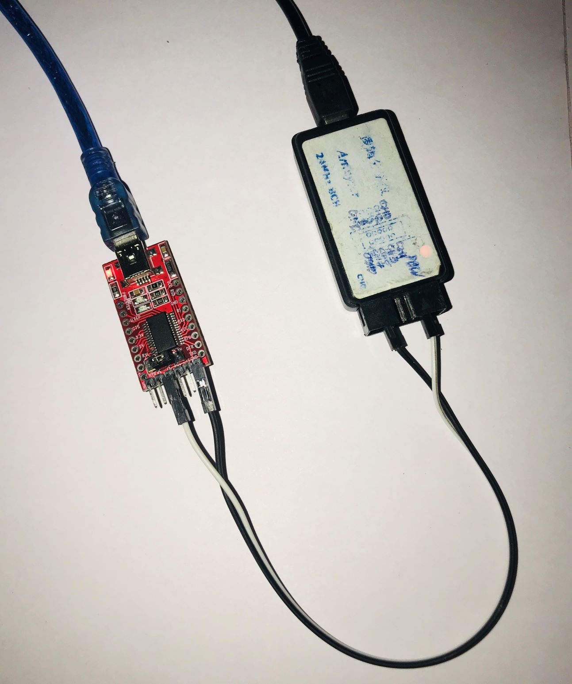

# RS232 to LIN Convertor
## Description:
The data conversion from **RS232** to **LIN** is very useful in case of changing the past mechanism generation to present. Those days we could find lot of communication processed by **RS232** which was quite impressive on those days :astonished: but not today :smiley:. There are so many communication available at present. The main perspective of introducing new communication is mainly for speed of data transfer and highly Encrypted data. The **LIN** communication is one among them. you can find complete information regarding [RS232](https://en.wikipedia.org/wiki/RS-232) and [LIN](https://en.wikipedia.org/wiki/Local_Interconnect_Network) here.

## Requirements:
1. USB - Serial Adapter.
2. RS232 - TTL converter.
3. LIN Tranceiver.
4. Logic analyser.

## Pre-Installation on Windows:
1. [GCC](https://jmeubank.github.io/tdm-gcc/)
2. [Logic analyser software (Saleae)](https://www.saleae.com/downloads/)


## Procedure:
1. Download the code from the repository.
2. Open the file RS232-LIN
3. Open Command prompt on /RS232-LIN and run the following command:
```
	$ gcc -o linsend lin-send.c argparse.c
```
4. linsend.exe file will be generated on the same PATH.
5. Open PowerShell on the same PATH and follow the command line given below:

```
	$ ./linsend.exe -h
```
6. Run the below command to send LIN data
```
	$ lin-send -c COM1 -i 0x23 -d 0x12,0x96,0x34,0x45,0x00,0x00,0x00,0x00
```

## Caution:
* This project files are only for Window OS.

## Connections:

	
* white line - FT232(TX pin)--Logic analyser channel.
* Black line - FT232(GND)--Logic analyser GND.

## Demo:


 


